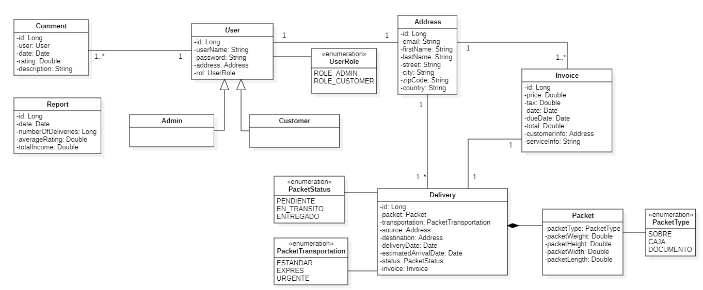
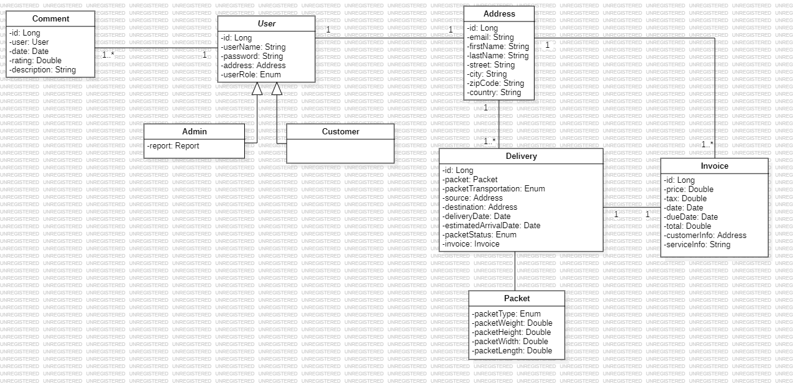

# Proyecto-paquetes

## Guía rápida

Es necesario tener instalado Maven como gestor de dependencias y del proyecto así como una versión de Java 17 o superior.

1. Clona el proyecto en local
    ```bash
    git clone https://github.com/alvaroLorente1/Proyecto-paquetes.git
    ```  

2. Arranca la aplicación con Maven
    ```bash
    mvn spring-boot:run 
    ```

## Motivación
Se desea implementar una aplicación que gestione el envío y seguimiento de paquetes en una empresa de transporte, se llevará el control de los envíos de paquetería.

## Funcionamiento
Un usuario accede a la aplicación y puede elegir entre hacer un envío o realizar el seguimiento de un envío ya realizado.  

Para consultar los detalles de un envío ya realizado, no es necesario ser cliente dado de alta en el sistema. Sin embargo, para poder realizar un envío hay que darse de alta como cliente para poder elegir los detalles del envío, así como poder descargar la factura correspondiente.  

Los clientes podrán valorar y dejar comentarios sobre el servicio ofrecido para que el administrador pueda incluir mejoras en la aplicación. 
Además, el administrador tendrá un panel de control para poder realizar operaciones sobre los usuarios, y además, registrar nuevos usuarios.  

Por último, el administrador desde el panel podrá generar un reporte del estado actual de la empresa en el que se detallen el número de envíos gestionados, la puntuación media del servicio y los ingresos totales en el sistema.

## Arquitectura
Para implementar la aplicación, se ha decidido dividir las funcionalidades en los siguientes servicios: usuarios, envíos, reportes, comentarios y facturas.
Diagrama diseño

Diagrama analisis


 **Servicio de gestión de usuario**  

Es el encargado de gestionar toda la lógica relacionada con los usuarios del sistema, que podrán ser los siguientes:  

* Visitante: usuarios que acceden a la página web para obtener información sobre los servicios ofrecidos. 
No están autenticados.
No tienen acceso a funciones de envío o gestión.
Pueden consultar el estado básico de cualquier envío.
Puede registrarse en el sistema como cliente.
Puede ver las valoraciones de otros clientes sobre el servicio.
* Cliente: representa al usuario que se autentica en el sistema.
Puede crear y consultar los detalles de los envíos que ha realizado. 
Puede modificar su perfil de usuario pero no puede eliminarlo.
Puede descargar la factura de un envío.
Puede añadir una valoración sobre el funcionamiento del sistema.
* Administrador: es un tipo de usuario que representa al administrador del sistema o gestor de la empresa que utiliza la aplicación.Puede hacer lo mismo que un cliente y además:
Crear o modificar clientes.
Eliminar clientes excepto a sí mismo.
Generar un reporte de operaciones incluyendo el número de envíos realizados, la puntuación media y los ingresos del sistema.

**Servicio de gestión de envíos**  

Es el encargado de la gestión completa del envío y del cálculo del coste. Ademas permitirá las siguientes funcionalidades:  

* Recuperar todos los envíos del sistema.
* Recuperar los envíos realizados por un único usuario.
* Crear un envío  y guardarlo en el sistema con las siguientes características:  

* Características del paquete: tipo (sobre, caja o documento), peso y dimensiones (alto, ancho y largo).
* Tipo de transporte: estándar (7 días), exprés (3 días), urgente (1 día).
* Origen.
* Destino.
* Fecha de envío.
* Fecha estimada de llegada.
* Estado: en espera, en tránsito o entregado.
* Coste.
* Factura del envío.

**Servicio de gestión de reportes**  

Es el encargado de generar los reportes asociados a los envíos realizados por el total de los clientes y la factura de un envío individual. Tendrá los siguientes componentes:  

* Factura: información financiera relacionada con los detalles de un envío en concreto.
* Coste
* Impuestos
* Fecha de emisión
* Datos del cliente
* Reporte: estado financiero de la empresa para un periodo determinado.
* Número de envíos realizados
* Puntuación media de los clientes
* Facturación total.

**Servicio de gestión de comentarios**  

Es el encargado de gestionar las valoraciones de los clientes del sistema de manera que se pueda detectar puntos de mejora.  

Estos comentarios estarán disponibles en una sección independiente de la aplicación de manera que potenciales clientes puedan consultar la calidad del servicio ofrecido. Los comentarios estarán compuestos por:
* Usuario. Que deberá existir como cliente en el sistema
* Puntuación.
* Descripción del comentario.


