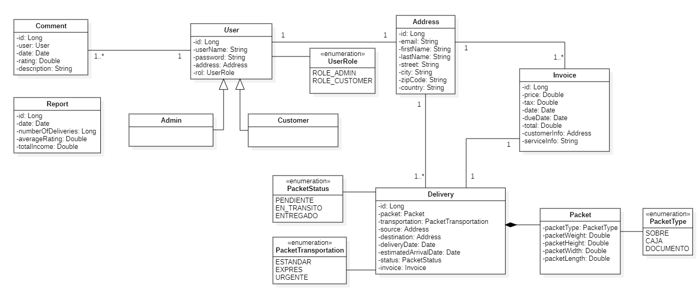
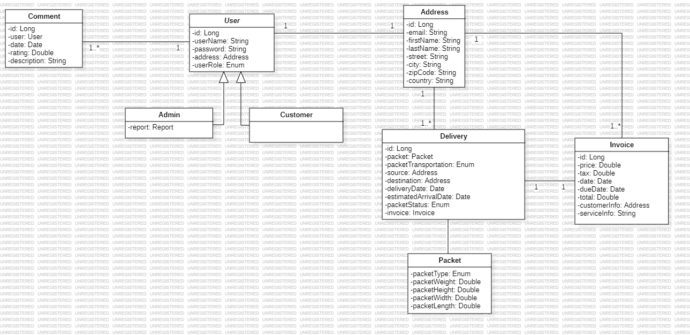

# Sistema de Gestión de Paquetería 📦

Aplicación web empresarial desarrollada con Spring Boot para la gestión integral de servicios de transporte y paquetería. Implementa cálculo automático de tarifas, generación de documentos PDF, control de acceso basado en roles y sistema de métricas empresariales.

## 📋 Tabla de contenidos

- [Funcionalidades del Sistema](#funcionalidades-del-sistema)
- [Tecnologías Utilizadas](#tecnologías-utilizadas)
- [Requisitos del Sistema](#requisitos-del-sistema)
- [Instalación y Ejecución](#instalación-y-ejecución)
- [Acceso a la Aplicación](#acceso-a-la-aplicación)
- [Estructura del Proyecto](#estructura-del-proyecto)
- [Arquitectura del Sistema](#arquitectura-del-sistema)
- [Funcionalidades por Servicio](#funcionalidades-por-servicio)
- [Algoritmo de Cálculo de Precios](#algoritmo-de-cálculo-de-precios)
- [Base de Datos](#base-de-datos)
- [Configuración de Seguridad](#configuración-de-seguridad)
- [Consideraciones Técnicas](#consideraciones-técnicas)

## 🚀 Funcionalidades del sistema

- **Gestión de envíos**: CRUD completo con cálculo automático de precios, fechas y estados
- **Generación de documentos PDF**: Facturas y reportes mediante iText 5.5.13.3
- **Sistema de seguimiento**: Consulta de envíos por ID y usuario
- **Control de acceso**: Tres roles con permisos diferenciados (SINGLE_TABLE inheritance)
- **Sistema de retroalimentación**: Valoraciones numéricas y comentarios descriptivos
- **Reportes empresariales**: Agregación de métricas (ingresos, envíos, rating promedio)
- **Autenticación**: Form-based authentication con Spring Security 6.x
- **Frontend**: Vistas Thymeleaf con integración Spring Security

## 🛠️ Tecnologías utilizadas

| Tecnología | Versión | Propósito |
|------------|---------|-----------|
| Java | 17+ | Lenguaje de programación |
| Spring Boot | 3.2.5 | Framework backend |
| Spring Data JPA | 3.2.5 | Persistencia de datos |
| Spring Security | 6.x | Seguridad y autenticación |
| Thymeleaf | 3.x | Motor de plantillas frontend |
| H2 Database | Runtime | Base de datos en memoria |
| Maven | - | Gestión de dependencias |
| Lombok | 1.18.32 | Reducción de código boilerplate |
| iText PDF | 5.5.13.3 | Generación de documentos PDF |

## 📦 Requisitos del sistema

- Java 17+
- Maven 3.6+

## 🔧 Instalación y ejecución

```bash
# Clonar repositorio
git clone https://github.com/alvaroLorente1/Proyecto-paquetes.git

# Compilar
mvn clean install

# Ejecutar (desde el directorio del módulo principal)
cd ProyectoAlvaroLorenteAlman
mvn spring-boot:run
```

**Aplicación disponible en:** http://localhost:9000

## 🌐 Acceso a la aplicación

| Recurso | URL | Credenciales |
|---------|-----|--------------|
| **Aplicación Web** | http://localhost:9000 | Ver tabla inferior |
| **Consola H2** | http://localhost:9000/h2-console | Usuario: `sa` / Contraseña: _(vacía)_ |
| **JDBC URL** | `jdbc:h2:mem:test` | - |

### Credenciales de usuario

Usuarios cargados desde `import.sql`:

| Rol | Usuario | Contraseña |
|-----|---------|------------|
| Administrador | admin | admin |
| Cliente | cliente1 | cliente1 |

## 📁 Estructura del proyecto

```
proyecto-paquetes/
└── ProyectoAlvaroLorenteAlman/
    ├── src/
    │   ├── main/
    │   │   ├── java/com/salesianostriana/dam/proyectoalvarolorentealman/
    │   │   │   ├── controller/        # Controladores MVC
    │   │   │   ├── model/             # Entidades JPA
    │   │   │   ├── repository/        # Repositorios Spring Data
    │   │   │   ├── service/           # Lógica de negocio
    │   │   │   ├── security/          # Configuración de seguridad
    │   │   │   ├── exception/         # Excepciones personalizadas
    │   │   │   └── json/              # Serializadores JSON
    │   │   └── resources/
    │   │       ├── templates/         # Plantillas Thymeleaf
    │   │       ├── static/            # CSS, JS, imágenes
    │   │       ├── schema.sql         # Esquema de base de datos
    │   │       ├── import.sql         # Datos iniciales
    │   │       └── application.properties
    │   └── test/                      # Tests (pendiente)
    └── pom.xml                        # Configuración Maven
```

## 🏗️ Arquitectura del sistema

### Patrón arquitectónico

Arquitectura en capas (Layered Architecture) con separación de responsabilidades:

| Capa | Paquete | Responsabilidad |
|------|---------|-----------------|
| **Presentación** | `controller/` | Controladores MVC/REST, manejo de peticiones HTTP |
| **Negocio** | `service/` | Lógica de negocio, cálculos, transacciones |
| **Persistencia** | `repository/` | Acceso a datos mediante Spring Data JPA |
| **Modelo** | `model/` | Entidades JPA, relaciones, herencia SINGLE_TABLE |
| **Seguridad** | `security/` | Configuración Spring Security |

### Diagramas

**Diagrama de clases:**


**Diagrama de análisis:**


## 📋 Funcionalidades por servicio

### 👤 Servicio de gestión de usuarios

**Modelo de herencia**: SINGLE_TABLE con discriminador por columna `role`

**Jerarquía de clases:**
- `User` (clase abstracta base)
  - `Customer` (ROLE_CUSTOMER)
  - `Admin` (ROLE_ADMIN)

**Matriz de permisos:**

| Funcionalidad | Visitante | Cliente | Administrador |
|---------------|-----------|---------|---------------|
| Consultar envíos | ✅ | ✅ | ✅ |
| Ver valoraciones | ✅ | ✅ | ✅ |
| Registrarse | ✅ | - | - |
| Crear envíos | ❌ | ✅ | ✅ |
| Descargar facturas | ❌ | ✅ | ✅ |
| Modificar propio perfil | ❌ | ✅ | ✅ |
| Añadir valoraciones | ❌ | ✅ | ✅ |
| Eliminar propia cuenta | ❌ | ❌ | ❌ |
| Gestionar usuarios | ❌ | ❌ | ✅ |
| Eliminar otros usuarios | ❌ | ❌ | ✅ (excepto sí mismo) |
| Generar reportes | ❌ | ❌ | ✅ |

### 📦 Servicio de gestión de envíos

**Operaciones CRUD:**
- `getAllDeliveries()`: Recuperar todos los envíos
- `getDeliveryById(Long id)`: Recuperar envío específico
- `getDeliveriesByUsername(String username)`: Filtrar por usuario
- `createDelivery(Delivery delivery)`: Crear con cálculos automáticos

**Proceso de creación de envío:**
1. Validación de dirección origen (debe existir en sistema)
2. Cálculo de volumen: `alto × ancho × largo`
3. Cálculo de precio (ver sección Cálculo de Precios)
4. Determinación de días de entrega según transporte
5. Asignación de estado según tipo de transporte
6. Generación automática de factura
7. Persistencia con cascada de relaciones

**Enumeraciones:**

| Enum | Valores | Descripción |
|------|---------|-------------|
| `PacketType` | SOBRE, CAJA, DOCUMENTO | Tipo de paquete |
| `PacketTransportation` | URGENTE, EXPRES, ESTANDAR | Modalidad de envío |
| `PacketStatus` | PENDIENTE, EN_TRANSITO, ENTREGADO | Estado del envío |

**Configuración de transporte:**

| Tipo | Días | Estado inicial |
|------|------|----------------|
| URGENTE | 1 | EN_TRANSITO |
| EXPRES | 3 | PENDIENTE |
| ESTANDAR | 7 | PENDIENTE |

### 💰 Servicio de gestión de facturas

**Generación de PDF mediante iText 5.5.13.3**

Componentes de la factura:
- Información del servicio
- Datos del cliente (origen)
- Precio base calculado
- Impuestos aplicados (10%)
- Total final
- Fechas: emisión (fecha de envío) y vencimiento (fecha estimada de llegada)

### 📊 Servicio de gestión de reportes

**Generación de reportes empresariales en PDF**

Métricas incluidas:
- Número total de envíos procesados
- Puntuación media de valoraciones (promedio de todos los comentarios)
- Ingresos totales acumulados (suma de todas las facturas)
- Tabla detallada de comentarios (fecha, puntuación, descripción)

### ⭐ Servicio de gestión de comentarios

**Sistema de retroalimentación de clientes**

Funcionalidades:
- Registro de valoraciones numéricas
- Almacenamiento de comentarios descriptivos
- Consulta pública de valoraciones
- Vinculación con usuario autenticado

## 💵 Algoritmo de cálculo de precios

**Implementación:** `DeliveryService.calculatePrice(Packet packet, Double packetVolume)`

### Fórmula de precio base

| Tipo | Fórmula |
|------|---------|
| `SOBRE` | `2.00` |
| `CAJA` | `5.00 + (volumen / 1000)` |
| `DOCUMENTO` | `1.00` |

**Volumen:** `alto × ancho × largo` (cm³)

### Multiplicadores

| Condición | Multiplicador |
|-----------|---------------|
| Peso > 1.0 kg | `×1.1` |

### Impuestos

**IVA:** 10% del precio final
- `total = precio × (1 + 0.1)`

### Ejemplo de cálculo

```
Input:
  tipo = CAJA
  dimensiones = 50 × 30 × 20 cm
  peso = 1.5 kg

Cálculo:
  volumen = 50 × 30 × 20 = 30,000 cm³
  precio_base = 5.00 + (30,000 / 1,000) = 35.00 €
  precio_ajustado = 35.00 × 1.10 = 38.50 € (sobrepeso)
  iva = 38.50 × 0.10 = 3.85 €
  total = 38.50 + 3.85 = 42.35 €
```

## 🗄️ Base de datos

### Configuración JPA

| Propiedad | Valor |
|-----------|-------|
| Motor | H2 Database (en memoria) |
| JDBC URL | `jdbc:h2:mem:test` |
| DDL | `none` (schema manual) |
| Inicialización | `schema.sql` + `import.sql` |
| Modo init | `always` |
| Persistencia | No persistente (volatil) |

### Modelo de datos

**Entidades principales:**

| Entidad | Tipo | Descripción |
|---------|------|-------------|
| `User` | Abstracta | Clase base con herencia SINGLE_TABLE |
| `Customer` | Concreta | Rol ROLE_CUSTOMER |
| `Admin` | Concreta | Rol ROLE_ADMIN |
| `Delivery` | Entidad | Gestión de envíos |
| `Invoice` | Entidad | Facturación |
| `Comment` | Entidad | Valoraciones |
| `Report` | Entidad | Reportes empresariales |
| `Address` | Entidad | Direcciones postales |
| `Packet` | Embebido | Datos del paquete (dentro de Delivery) |

### Relaciones JPA

| Relación | Cardinalidad | Cascada |
|----------|--------------|---------|
| `User` → `Address` | One-to-One | ALL |
| `Delivery` → `Address` (origen) | Many-to-One | - |
| `Delivery` → `Address` (destino) | Many-to-One | ALL |
| `Delivery` → `Invoice` | One-to-One | ALL |
| `Delivery` → `Packet` | Embedded | - |
| `Comment` → `User` | Many-to-One | - |

## 🔒 Configuración de seguridad

**Framework:** Spring Security 6.x
**Configuración:** `SecurityConfiguration.java`

### Autenticación

| Aspecto | Configuración |
|---------|---------------|
| Método | Form-based authentication |
| Login URL | `/login` |
| Success URL | `/dashboard` |
| Failure handler | Custom con parámetro `?error=true` |
| Password encoder | `{noop}` (texto plano - **solo desarrollo**) |
| UserDetailsService | Carga desde base de datos vía `UserService` |

### Autorización de endpoints

**Estado actual:** Todos los endpoints configurados como `.permitAll()`

```java
.requestMatchers("/h2-console/**", "/css/**", "/js/**", "/img/**").permitAll()
.requestMatchers("/", "/index", "/login", "/register").permitAll()
.requestMatchers("/deliveries/**", "/users/**", "/invoices/**",
                 "/reports/**", "/comments/**").permitAll()
```

**Recursos estáticos permitidos:**
- `/h2-console/**` - Consola de base de datos
- `/css/**`, `/js/**`, `/img/**` - Assets estáticos

**Endpoints de aplicación:**
- `/`, `/index`, `/login`, `/register` - Acceso público
- `/deliveries/**`, `/users/**`, `/invoices/**`, `/reports/**`, `/comments/**` - Actualmente público

### Configuración CSRF

- **H2 Console:** CSRF deshabilitado para `/h2-console/**`
- **Headers:** Deshabilitados para permitir H2 Console en iframe

---

## ⚠️ Consideraciones técnicas

### Seguridad
- **Contraseñas sin encriptación**: Se utiliza `{noop}` (texto plano) - apropiado solo para desarrollo
- **Endpoints públicos**: Todos los endpoints están configurados como `.permitAll()`
- **Para producción**: Implementar BCrypt y control de acceso basado en roles

### Base de Datos
- **H2 en memoria**: Los datos se pierden al reiniciar la aplicación
- **Persistencia**: Para producción, migrar a base de datos persistente (MySQL, PostgreSQL)

### Dependencias
- **Lombok**: Requerido en el IDE para compilación
- **iText 5.5.13.3**: Librería para generación de PDFs (licencia AGPL)

## 📄 Información del proyecto

**Programa:** Desarrollo de Aplicaciones Multiplataforma (DAM)
**Tipo:** Proyecto académico


